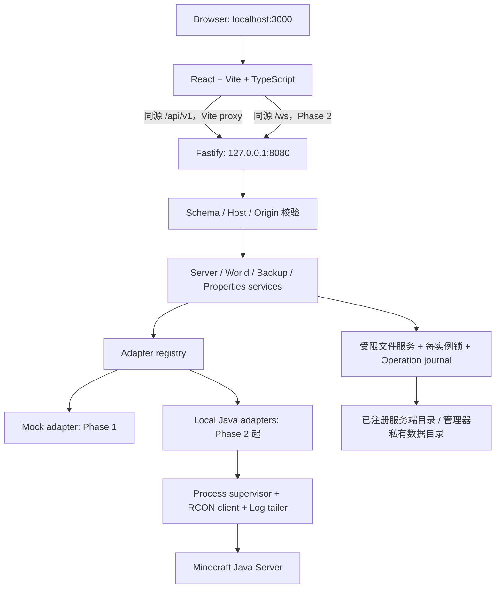

# Minecraft Java Server Manager — 系统架构

状态：设计稿 v1；设计 Review 结果见文末。当前交付只有设计文档，不包含可运行应用。

## 1. 需求与第一轮边界

产品是本地优先的 Minecraft Java 服务端管理器。先把浏览器、React、Fastify 和本地 Java 进程之间的闭环做可靠，再扩展远程访问。目标用户是管理已有服务端目录的服主；第一版不自动下载 Java、服务端 JAR 或第三方 Mod，也不替用户接受 Minecraft EULA。

本轮完成系统架构、目录结构、API、统一 Adapter、Dashboard 设计和 Phase 1 实施计划。设计完成后提交用户确认，再开始 Phase 1 编码。每个 Phase 测试与 Review 通过后仍需用户确认，才进入下一阶段。后续阶段只定义边界，不提前实现。

| 必须满足 | 设计决策 |
| --- | --- |
| 本地可运行 | Windows 优先，Node.js 单进程后端；前端 3000、后端 8080 |
| 多种服务端 | 统一 Adapter + 后端识别 + capabilities；拒绝前端按名称猜测 |
| 真实数据 | 每个指标携带来源、时间和可用性；不可获取显示 N/A |
| 不丢存档 | 停服一致性快照、恢复前备份、暂存验证、事务日志 |
| 可恢复删除 | Mods / Plugins 移入 trash，提供恢复；无永久删除 API |
| 明确重启 | 文件和配置改动返回 restartRequired；用户另行发起重启 |
| 本地安全 | 明确绑定 127.0.0.1；校验 Host / Origin、路径和上传 |
| 逐步交付 | Phase 1 用后端 Mock fixture；真实 Java 管理从 Phase 2 开始 |

## 2. 总体架构



开发环境浏览器只访问 3000；`/api` 转发至 `http://127.0.0.1:8080`，`/ws` 在 Phase 2 转发至同一后端。保留真实浏览器 Origin，不设置 rewriteWsOrigin。后端不信任代理头，trustProxy=false。

Vite 与 Fastify 都显式绑定 127.0.0.1；Vite strictPort=true，端口占用立即提示，不能静默切换。`localhost` 可能解析到 IPv6；启动说明同时提供 `http://127.0.0.1:3000`，不为解决解析问题扩大监听范围。移动端适配首先通过浏览器设备模拟验证；物理手机远程连接留到 Phase 7。

本地构建运行模式计划由 Fastify 的 8080 提供 `apps/web/dist` 与 API；3000 为开发入口。仅静态发布 web/dist，不能把整个仓库或服务端目录当静态根目录。

## 3. 技术选择与模块职责

- 前端：React + Vite + TypeScript strict；React Router 负责路由，TanStack Query 负责服务端状态；本地交互使用 React state，暂不引入 Redux。
- UI：CSS variables、CSS Grid / Flex、可访问的基础组件；图标统一使用同一轻量图标库，不引入大型管理后台模板。
- 后端：Node.js 24 LTS 作为拟定运行基线，Fastify + TypeScript；Phase 1 锁定实际兼容依赖及 lockfile，使用 npm workspaces，避免增加另一套包管理工具。
- 合约：`packages/contracts` 使用 TypeBox 定义 JSON Schema 并导出静态 TypeScript 类型。它只包含纯合约，不依赖 Node、Fastify、React 或任何秘密配置。Fastify 请求和响应都挂接 schema；前端在网络边界验证响应。
- 测试：后端 Vitest + Fastify inject；前端 Vitest + Testing Library；关键闭环使用 Playwright。测试多少由阶段风险决定。
- 日志：Fastify 结构化日志；Minecraft 日志独立流；统一脱敏后才能进入 REST、WebSocket、导出或 Crash Analysis。
- 存储：早期使用管理器私有 JSON 文件与原子替换，不引入数据库。配置 schemaVersion 固定；有索引与事务需求后再评估 SQLite，不能为预留能力提前上数据库。

| 层 | 负责 | 禁止 |
| --- | --- | --- |
| React | 显示后端 DTO、收集输入、确认操作、订阅事件 | fs、child_process、秘密、服务端类型推断 |
| Fastify routes | 校验、DTO 序列化、HTTP / WS 映射 | 直接拼接系统命令或文件路径 |
| Services | 工作流、并发锁、备份策略、阶段功能门控 | 将请求 body 当内部配置使用 |
| Adapters | 服务端能力、协议差异、启动参数构建、数据采集 | HTTP 状态码、UI 逻辑、任意 shell |
| Infrastructure | 安全文件 IO、进程、RCON、日志、存储 | 将密码或完整启动环境导出到 DTO |

## 4. 拟定目录结构

以下是演进目标；Phase 1 只创建标注 P1 的内容，其他目录在对应阶段首次实现时创建。

```text
.
├─ docs/
│  ├─ ARCHITECTURE.md                 本文
│  ├─ UI_SPEC.md                      Dashboard、交互与响应式规范
│  └─ API_SPEC.md                     DTO、端点和事件规范
├─ package.json                       P1: npm workspaces / dev / build / checks
├─ package-lock.json                  P1: 固定依赖
├─ tsconfig.base.json                 P1: strict 共享规则
├─ apps/
│  ├─ web/                            P1
│  │  ├─ src/app/                     routes / providers / AppShell
│  │  ├─ src/features/dashboard/      Dashboard 页面与组件
│  │  ├─ src/components/              Button / Card / Badge / States
│  │  ├─ src/lib/api/                 fetch、响应校验、错误映射
│  │  ├─ src/styles/                  tokens / layout / global
│  │  ├─ src/features/servers/        P1: 只读列表；P2 增加生命周期
│  │  ├─ src/features/console/        P2: Console / WebSocket
│  │  └─ vite.config.ts
│  └─ api/                            P1
│     ├─ src/app.ts                   可注入构建函数，测试不占端口
│     ├─ src/main.ts                  启动、绑定、关闭
│     ├─ src/config/                  mode / bind / local paths
│     ├─ src/routes/                  health / servers / overview
│     ├─ src/services/                server service，后续领域服务
│     ├─ src/adapters/                 contract / registry / mock (P1)
│     │  └─ local/                    vanilla (P2), paper / fabric (P5)
│     ├─ src/infra/                   security (P1)，process / rcon / logs (P2)
│     ├─ src/fixtures/                P1: 后端集中管理 Mock 场景
│     └─ src/{worlds,backups,addons}/  P3 / P5 按需添加
├─ packages/contracts/src/            P1: shared schemas / errors / DTOs
├─ tests/e2e/                         P1: Dashboard API 联通
├─ tests/fixtures/                    小型合成文件；不得包含真实存档与密码
└─ .manager/                          runtime，Git 忽略，不能位于服务器目录内
   ├─ config.json                    目录注册表、Java executable、启动配置
   ├─ operations/                    持久化长任务状态与恢复检查点
   ├─ backups/<serverId>/             不可变归档、manifest、checksum
   ├─ archives/<serverId>/            已归档世界
   └─ staging/                       有配额的上传 / 恢复暂存
```

`serverRoot` 可指向仓库之外的已有本地目录，但只能由用户在后端本地配置中注册；HTTP 使用不透明 serverId，不能发送任意 serverRoot 或 Java executable。需要运行时操作权限时明确提示具体目录。第一版用 3 个实例场景验证切换，每实例串行处理有写入风险的操作，跨实例可独立工作；不因此限制用户注册数量。

## 5. Adapter 设计

```ts
type ServerType =
  | 'vanilla' | 'paper' | 'spigot' | 'purpur'
  | 'fabric' | 'forge' | 'neoforge' | 'unknown';

// Imported domain types 在实施阶段定义；这是设计合约，不是可执行源码。
interface MinecraftServerAdapter {
  getServerInfo(): Promise<ServerInfo>;
  getStatus(): Promise<ServerStatus>;
  getPlayers(): Promise<Player[]>;
  start(): Promise<void>;
  stop(): Promise<void>;
  restart(): Promise<void>;
  getConsoleLogs(): Promise<LogEntry[]>;
  sendCommand(command: string): Promise<string>;
  listMods?(): Promise<ModInfo[]>;
  installMod?(file: UploadedFile): Promise<void>;
  disableMod?(id: string): Promise<void>;
  removeMod?(id: string): Promise<void>;
  listPlugins?(): Promise<PluginInfo[]>;
  installPlugin?(file: UploadedFile): Promise<void>;
  disablePlugin?(id: string): Promise<void>;
  removePlugin?(id: string): Promise<void>;
}
```

`ServerInfo` 使用 API_SPEC 中的安全 DTO；内部另有私有 `ServerRegistration`（绝对路径、Java executable、内存配置、秘密引用）。`ServerStatus` 是状态快照，service 在 ServerSummary 中另行组装 readiness。`UploadedFile` 是后端校验并暂存后的 opaque handle，包含生成的 stagingId、字节数、SHA-256 和显示文件名；客户端不能指定它的内部路径。`getConsoleLogs` 只返回有上限的近期日志；分页与事件订阅由 Log service 负责。

原始接口补充两个可选方法 `restoreMod?(id)`、`restorePlugin?(id)`，分别恢复 disabled 或 trashed 文件到原目标；冲突时不覆盖。每个 JAR 是一个文件操作单位，可能包含多个 metadata 条目，不能把同 JAR 的多个 Mod 当多个可独立删除的文件。

能力判断来自后端 `DetectionResult`，HTTP service 每次同时检查能力、阶段 features、可选方法是否存在与当前 readiness。禁止仅靠前端隐藏按钮。缺少实现返回 FEATURE_NOT_IMPLEMENTED；类型不支持返回 CAPABILITY_UNSUPPORTED；暂时不可操作返回 ACTION_UNAVAILABLE。

- `LocalJavaRuntime` 组合 Process supervisor、Command transport 和 Log reader，复用基础能力，不建深层继承树。
- `VanillaAdapter` 是 Phase 2 第一个真实实现；Paper / Fabric 在 Phase 5 通过组合扩展。Spigot / Purpur / Forge / NeoForge 仅保留类型与检测提示，没有虚假的已支持承诺。
- `AdapterRegistry` 按已验证检测结果创建 adapter；unknown 或尚未实现的类型可只读显示信息，不能退化为 Vanilla 启动。
- World service 和 Backup service 组合 adapter 的生命周期与 Layout descriptor，不塞进 adapter 的巨型接口。
- 同一实例的 restart 由 supervisor 完成 stop → wait exit → start；内部调用不再次获取同一锁，避免死锁。

## 6. 后端检测与功能门控

检测只读取文件和 ZIP metadata，不执行未知 JAR。依次检查已注册 launch target、JAR manifest / version metadata、Fabric launcher properties、loader libraries、Paper metadata / 配置与近期日志。目录名、`mods/` 或 `plugins/` 存在只能当弱证据，不能直接定类型；残留配置与混合证据产生 warnings。

返回 type、minecraftVersion（可 null）、java.runtimeVersion（可 null）、java.requiredMajor（可 null）、evidence 与 confidence（high / medium / low）。Java runtimeVersion 通过后端验证过的 executable 执行固定参数 `-version` 获取，设超时；requiredMajor 依据该服务端版本的可靠 metadata / 维护过的兼容表。世界 `DataVersion` 是世界最后写入版本的证据，不等同于当前服务端版本。不确定时显示 Unknown，需要启动配置核实，不能猜成 `1.21.x` 或统一 Java 21。

`capabilities` 表示后端识别出的引擎 / 布局支持；`features` 表示本阶段管理器已实现的领域；`readiness` 表示此刻动作能否执行。UI 可操作 = 已实现 feature + 所需 capability + readiness.allowed；这三层判断在后端也强制执行。

| 引擎 | mods | plugins | 首次真实实现 |
| --- | --- | --- | --- |
| Vanilla | false | false | Phase 2 |
| Paper | false | true | Phase 5 |
| Fabric | true | false | Phase 5 |
| Spigot / Purpur | false | true | 后续独立迭代 |
| Forge / NeoForge | true | false | 后续独立迭代 |
| unknown | false | false | 仅检测提示 |

RCON capability 表示协议支持，不代表启用或连接成功；readiness.commandTransport 单独报告 rcon / stdin / unavailable。console 表示可读取已注册日志，backup 表示已验证布局能够被备份，unknown 默认 false。Phase 1 Mock 返回明确 mode=mock，所有 lifecycle / commands readiness 都禁用。

## 7. 进程、Console 与数据真实性（Phase 2 / 6）

状态机：`stopped → starting → running → stopping → stopped`；意外退出为 crashed，无法确定进程身份为 unknown。spawn 成功不等于 running；需要启动日志信号与状态探测。监听 error / exit，启动期限默认 120 秒，优雅停服默认 60 秒，超时返回可读原因，不自动强杀。

以 `spawn(validatedJavaExecutable, validatedArgs, { cwd: serverRoot, shell: false })` 启动；参数按类型构建，HTTP 不接受 JVM / shell 参数字符串。禁止执行 .bat / .sh，不能通过 shell 包装解决 Windows 路径问题。EULA 未接受时阻止启动，用户自行阅读并接受。

RCON 优先；未配置 RCON 时，管理器拥有的子进程可通过 stdin 发送单条 Minecraft 命令。stdin 仅能确认提交，不能假称已取得完整命令响应；外部启动进程没有 stdin，则命令不可用。命令禁止换行、NUL 和控制字符，最长 1024 UTF-8 字节，限速；`stop` 等生命周期命令须经过同一操作锁。没有任意系统命令端点。

后端重启后不只凭 PID 认领进程；核验 executable、启动时间与注册目录，无法可靠重连时标记 external / unknown，仅提供已验证只读能力。不得杀死来源未知的 Java 进程。关闭管理器不静默终止 MC；启动说明交代应先显式停服以及下次启动的外部进程限制。

Console 以 `logs/latest.log` tail 为主，启动失败且没有日志时读取受控 stderr。处理日志轮换、截断、UTF-8 分片、半行与重复数据。每实例环形缓冲最多 2,000 行，每条输出最多 8 KiB；WebSocket sequence + cursor 支持补发与 gap 通知，慢客户端不能无限堆积。

指标均携带 source 和 sampledAt。Players 名单可由 RCON list 或状态查询取得，但不能把状态查询的样本名单当完整名单。CPU / RAM 是 MC 进程指标，Disk 是注册目录所在卷的空间；RAM 的进程 RSS 不冒充 JVM heap。Uptime 从已核验启动时间计算。TPS / MSPT 只用可验证协议、插件或采样来源；Vanilla 默认 unavailable。Phase 6 才实现真实性能采集，不引入 JVM 插件或公开 JMX 来填满仪表盘。

## 8. Worlds 与备份事务（Phase 3）

World service 管理 world set：主世界及关联 Nether / End。Vanilla / Fabric 的目录与 Paper 的分离世界布局分别由 Layout descriptor 定义；拒绝只备份 overworld 而遗漏维度。自定义多世界插件的未知布局在明确支持前禁止完整性承诺。

世界详情包括 name、seed、最后写入版本、size、difficulty、gameMode、hardcore、pvp、viewDistance、simulationDistance。NBT 中 64-bit seed 序列化为十进制字符串，避免 JS 精度损失；生成前 properties 中的 level-seed 只是请求 seed。全局 properties 与世界 NBT 的有效设置分开标记来源，不假装都来自 level.dat。无法解析返回 unavailable，不能用零代替。

save-all 通过 command transport 发出；Phase 3 不做运行中逐文件复制的“完整备份”。初版一致性备份统一请求允许停服：锁实例 → 停服并确认退出 → 生成快照 → 校验 manifest / checksum → 若原来在运行则启动并检查日志。UI 在发起前显示停服影响；未允许停服且仍在运行，返回 SERVER_MUST_BE_STOPPED。若将来增加在线备份，须另行设计 save-off / save-all flush / finally save-on，不能仅发 save-all 就认为复制一致。

恢复操作（当前设计固定恢复后启动）：

1. 锁实例并验证目标 backupId、manifest、checksum、布局和版本兼容性，检查可用空间。
2. 将目标归档解包至 staging 并逐项校验；路径不安全或版本更高时阻止降级恢复。
3. 停服并确认退出；创建当前世界的 pre-restore 快照，标记 pinned。
4. 把当前 world set 移至 rollback staging；将目标 world set 切换到原受控位置；记录 journal。
5. 启动服务器，检查启动完成与近期 ERROR / crash 日志；完整错误信息保留但先脱敏。
6. 成功后提交事务；失败立即停下恢复的实例，保存目标、rollback 和快照，返回 rollbackAvailable=true，等待用户显式回滚。不能在状态未知时自动删除任一版本。

Phase 3 的 restoreScope 仅支持 world-set，即使来源备份是 server-snapshot 也只提取其中 manifest 声明的世界，UI 明确说明不会恢复 JAR / Addons / 配置。需要完整 server-snapshot 回滚时，必须在实际升级 / 批量 Addon 工作流加入前独立设计相同 scope 的 pre-change 快照与整服恢复事务，不能把世界恢复冒充完整服务器回滚。

文件系统多目录切换无法保证一次性原子完成；依靠每步持久化 journal、同卷 rename 和启动时 recoveryRequired 门控。进程在任一步中断时，禁止普通 start，先核对原目录、staging、manifest 再提供恢复 / 回滚。跨卷时先完整复制并校验，不能假装 rename 原子。

新建世界使用新目录与生成参数，旧世界先归档；上传 ZIP 先检查 level.dat 与维度结构；下载 / 归档当前世界也须取得停服一致性快照。初版不自动跨版本升级世界。

备份 manifest 包含 id、serverId、scope（world-set / server-snapshot）、kind（manual / auto / snapshot）、label、createdAt、minecraftVersion、serverType、includedRoots、字节数与 SHA-256。world-set 是常规存档备份；升级及 Addon 批量改动使用 server-snapshot，覆盖世界、JAR、配置与 Addons（排除日志、暂存、备份目录）。server-snapshot 中的 server.properties 与插件配置可能含密码，因此完整快照只在后端私有存储中使用，不提供 HTTP 下载；下载端点仅支持经秘密扫描的 world-set 归档，发现秘密则拒绝导出。后续若需导出完整快照，另行设计脱敏导出副本与独立 manifest，不能返回原始归档。

默认 retention：最近 10 份 manual / auto、最近 7 天；满足两项任一者保留。pinned、pre-restore、pre-upgrade / pre-addon-change 不自动清理。只清理同 serverId 的已完成备份，成功新建后再运行 retention，不触碰 staging 与失败现场。Scheduled Backup 使用明确 IANA timezone + daily time，每实例不重叠；首次默认 disabled，运行中默认跳过并提示，用户可明确开启允许停服。漏掉的计划不会堆积补跑。

## 9. Addons 与 Properties（Phase 4 / 5）

Addons 以 opaque addonId 绑定文件记录，metadata 只读，不执行 JAR。Mod 解析 fabric.mod.json、META-INF/mods.toml、META-INF/neoforge.mods.toml；Plugin 解析 plugin.yml / paper-plugin.yml。兼容性为 compatible / incompatible / unknown，带依据；Plugin api-version 不能证明完整 Minecraft 版本兼容性；占位版本未解析就报告 unknown。

```text
serverRoot/
  mods/                 enabled Mods
  disabled-mods/        disabled Mods
  plugins/              enabled Plugins
  disabled-plugins/     disabled Plugins
  trash/<entryId>/      original.jar + receipt.json
```

Disable 是移动；disabled 的 Restore 移回 enabled 目录；Delete 是移到 trash 并记录 original state / filename / checksum / timestamp，trashed 的 Restore 恢复删除前的 enabled / disabled 状态。Trash 无自动清空策略。默认要求停服后修改 Addons，运行时按钮说明原因。每次变动先创建受控文件回滚副本；批量安装 / 更新默认创建 server-snapshot，快照失败不修改。上传成功显示需重启，立即重启必须是用户单独选择；已停止实例下次 start 生效。

Properties 只编辑白名单：max-players、difficulty、gamemode、pvp、online-mode、view-distance、simulation-distance、motd。按检测版本的 schema 验证范围与枚举，禁止提交 rcon.password 或原始全文。GET 给安全 fields + revision；PATCH 使用 If-Match 防止覆盖外部修改，保存前备份原文件，保留注释与未知键；备份包含密码时只能存后端私有位置。所有第一版白名单修改保守标记需要重启，不能偷偷启动 / reload。

## 10. 安全约束

| 边界 | 约束 |
| --- | --- |
| 本地 HTTP | 127.0.0.1:8080；Host 只允许 localhost:8080 / 127.0.0.1:8080，拒绝伪造 forwarded headers |
| 浏览器来源 | Origin 只允许 http://localhost:3000 / http://127.0.0.1:3000，构建模式增加对应 8080；拒绝 null / 外站 Origin |
| 写 API | JSON + X-Manager-Intent: local-ui + Origin 校验；缺失 Origin 的本地 CLI 也须有 intent；multipart 写入同样要求 intent；GET 无副作用 |
| WebSocket | Upgrade 阶段强制合法 Origin 与 Host，不能只依赖 CORS；仅后端推送日志与状态 |
| 秘密 | rcon.password、管理协议 secret、token、TLS keystore 密码不进 DTO / logs / 错误 / WS / 下载；递归响应 allowlist + 输出脱敏 |
| 本地路径 | ID → 已注册目录；canonical realpath + path.relative 验证边界，拒绝 junction / symlink、UNC、绝对上传名、..、NUL、Windows ADS / 保留名 |
| 新文件 | 校验最近存在的父目录，staging 用生成名，no-overwrite；重验目标父目录，拒绝链接与重解析点 |
| 上传 | 单个 JAR ≤ 100 MiB，世界 ZIP ≤ 2 GiB；有限流式写入、单实例上传、暂存总配额默认 12 GiB；预留卷空间至少 1 GiB，失败现场不能被超时清理误删 |
| ZIP / JAR | 校验 ZIP 结构而不只看扩展名；拒绝 Zip Slip、符号链接、重复规范化路径；最多 100,000 entries、解包 ≤ 8 GiB、metadata 单条 ≤ 1 MiB |
| 整体资源 | JSON body ≤ 64 KiB；命令 ≤ 1024 字节；WS 客户消息 ≤ 4 KiB；限速、连接数、空闲超时、磁盘剩余空间预检 |
| 本地权限 | 私有数据不对其他用户开放；Windows 使用实际可用 ACL，不能把 chmod 当已生效；必要时提示具体权限问题 |

Phase 1 只实现已经暴露的读 API 的 Host / Origin / schema 校验和秘密隔离；写入、上传与 WS 在各自功能阶段落地上述策略。Phase 1 mode 固定为 mock，传入 local 配置立即报未实现，不将 fixture 当作本地实例。文件校验防范 HTTP 输入与上传攻击；无法保证防御同机恶意用户竞态替换目录，因此注册根目录须由可信本地用户控制。本地模式没有身份认证，不能抵御同机具有同等文件权限的恶意用户。Phase 7 必须独立加入登录、会话、防 CSRF、授权、TLS 与审计，不能通过改成 0.0.0.0 就宣称支持远程。

管理器绑定不代表 Minecraft 的 25565 / RCON 自动受保护。真实实例接入时检查 server-ip / RCON 实际监听，告知已有公开监听；不偷偷修改现有 properties。新建本地测试实例默认 server-ip=127.0.0.1，RCON 客户端只连接注册实例的本地地址，不返回密码，也不默认启用额外远程管理协议。

## 11. Phase 1 实施计划与验收

| 步骤 | 负责人 | 可审查交付 | 验收 |
| --- | --- | --- | --- |
| P1.1 工具与合约 | GPT-5.6 Sol | npm workspace、TS strict、schemas、lint / build / test scripts | 干净安装、共享包两端能编译、响应无秘密 |
| P1.2 后端 Mock | GPT-5.6 Sol | health、servers、overview、MockAdapter、固定 fixtures | inject 测试；Host / Origin；404；错误 envelope；无真实 IO |
| P1.3 UI shell | GPT-5.6 Sol | 导航、选择实例、布局、tokens、phase 门控 | 360 / 768 / 1440 宽度、键盘导航、无页面横向溢出 |
| P1.4 Dashboard | GPT-5.6 Sol | API client、八项指标、活动、服务器卡片、空 / 错 / 断线状态 | fixture 来源可见、N/A 语义、不能执行真实操作 |
| P1.5 集成与说明 | GPT-5.6 Sol | 同源 proxy、启动 / 构建说明、关键 E2E | 浏览器数据确实来自 8080；后端停止有错误反馈；重试恢复 |
| P1.6 Review | GPT-6 Astra | 架构 / 安全 / API / UI Review、必要修复 | 所有阶段检查通过、review diff、commit、可用 remote 下 push / PR |

Phase 1 只启用 dashboard 和只读 servers；其余导航保留“Phase N”，可以查看解释性占位页。Start / Stop / Restart、Console 输入、上传与恢复无可调用 API，按钮禁用并解释阶段，不用空 handler 假装操作成功。后端模式为 mock，前端不能自行生成成功状态或假玩家。

Phase 1 fixtures 至少包括：Paper running（Players 示例、TPS / MSPT unavailable）、Vanilla stopped、Fabric unknown / partial。支持零实例、API 断开、缺少 capability、未采集 / 过期指标。示例数值只在可见 Mock banner 下出现；真实 adapter 不复用这些数值作为默认值。

fixture 数值与事件可以固定，但正常场景的 observedAt / sampledAt 由可注入 Clock 生成当前模拟采样时间；stale 场景显式使用过去时间。API 文档中的固定时间只是示例，不让正常演示一启动就全部过期。

必要检查：contracts typecheck、前端 / 后端 build、后端 routes / response schema / missing server / host origin 单测、Dashboard 状态语义组件测试、1 条真实双进程 E2E 及 3 个视口检查。对关键数据断线 / 恢复用例做自动化；不写只验证 CSS 常量或照抄实现的测试。Phase 1 不需要 Java、真实服务器目录、RCON 密码或下载 MC JAR。

## 12. 后续阶段门槛

| Phase | 范围 | 进入下一阶段前至少验证 |
| --- | --- | --- |
| 2 | Vanilla、状态、生命周期、日志 / WS、RCON 优先 | 真实测试实例启动 / 优雅停服 / 重启；并发冲突；日志轮换；断线补发；密码脱敏 |
| 3 | Worlds、Manual / Scheduled Backup、restore / retention | 主世界与维度覆盖；逐步故障注入；断电 journal 恢复；预恢复快照失败不覆盖；Zip Slip 拒绝 |
| 4 | Players、properties | UUID 稳定 ID；名单来源与完整性；输入范围；If-Match；秘密不泄漏；保存前备份 |
| 5 | Addons CRUD、Paper / Fabric、Adapter 完成 | 多引擎合约测试；metadata；Disable / Restore / Trash；冲突与超限；Adapter 与 Addons 高级 Review |
| 6 | 真指标与 Crash Analysis | 来源真实；unavailable / stale；日志脱敏；规则与证据匹配；无法诊断不假称确定 |
| 7 | Authentication、Remote Access | 开始前高级安全 Review；用户确认远程方案；登录 / 授权 / CSRF / WS / TLS / Tunnel 验证 |

Upgrade 操作不是当前七阶段的隐含任务。Phase 3 提供 snapshot 基础；未来实际升级必须有独立计划，操作前强制 pre-upgrade 快照。Crash Analysis 第一版只做本地规则与日志证据，不把日志上传外部模型或服务。

## 13. 模型与 Git 工作流

GPT-6 Astra 负责上述架构、UI 规范、复杂决策、安全与高级 Review。GPT-5.6 Sol 负责 Phase 1 起普通实现、测试、重构与文档维护；实际调用时明确 model=gpt-5.6-sol，不用 Astra 默默代替。只有整体架构变更、跨 Adapter 分歧、文件安全 / 恢复事务问题、定位不明的复杂 Bug 或上述 Review 节点升级给 Astra。

五个强制高级 Review 节点：Phase 1 架构确定后（本轮）；Adapter 架构实现完成后（Phase 5 接入前后核对）；Mods / Plugins 完成后；Remote Access 开始前；第一版正式发布前。Adapter 与 Addons 即使同属 Phase 5 也分别记录检查结果。正式发布前再次检查安全、API / adapter 一致性、移动端、真实 MC 验证和测试覆盖，不以本轮设计检查代替。

每个独立功能走 feature branch → implementation → test → review diff → Conventional Commit → push → PR。只在测试通过后进入合并评审，禁止 force push main。主智能体最终检查相关 diff，创建 PR 后关联到任务。没有 remote 时先完成本地 branch / test / review / commit，说明 push / PR 尚未完成，不猜测 GitHub 仓库或创建外部项目。

本轮工作区无现有仓库 / remote / Git 用户身份，建立 `feature/architecture-design`。文档提交可使用仅该次命令有效的 Codex <codex@localhost> 代理署名，不修改全局 Git 设置；后续对接 remote 时再使用用户已配置身份。

## 14. 设计 Review 记录

执行者：GPT-6 Astra。范围：需求、架构、UI_SPEC、API_SPEC；这不是运行测试或已实现安全保证。

| 检查项 | 结论与落地约束 |
| --- | --- |
| 架构合理性 | 单后端 + 组合式 adapters 足够；不引入微服务、数据库或远程 agent |
| 过度设计 | 后续模块只保留文档；Phase 1 不实现 Java / WS / 文件操作 |
| API 一致性 | mode / features / capabilities / readiness 分离；统一 envelope、errors 与 unavailable；见 API_SPEC |
| 安全 | 补入本地网页攻击、WS Origin、Windows junction / ADS、输出秘密与 ZIP 限制 |
| 数据保护 | 在线复制风险被停服快照策略替代；维度打包、pre-restore、journal / rollback 明确 |
| UX | Mock 永久可见；禁用原因、N/A、断线状态、重启单独确认；见 UI_SPEC |
| 移动端 | 360 起布局；物理手机访问留到远程阶段，无需扩大本地监听 |
| 可维护性 | 单一合约包、ID 映射、逐阶段目录、组合复用、少量必要测试 |

Review 结论：设计可进入 Phase 1，需用户确认本轮交付。编码完成后必须再次验证实际配置、UI 与测试，不能用设计 Review 替代运行验收。

GPT-5.6 Sol 已做只读文档校验：三份 Markdown 的 fences 成对、相对链接存在、两个 JSON 示例可解析、Phase 1 四个 GET 端点与核心状态字段一致。其发现的 Servers 目录阶段标注与 Settings feature 映射已修正；本地 diff 空白检查通过。本轮没有应用运行测试。

## 15. 技术依据

这些资料用于核实约束，不代表已实现。依赖精确版本与 Java 兼容表在对应阶段按实际版本再次核验。

- [Vite Getting Started](https://vite.dev/guide/)：Node 版本兼容条件；[Vite Server Options](https://vite.dev/config/server-options)：host、strictPort、proxy 与 WS Origin 注意事项。
- [Node.js Releases](https://nodejs.org/en/about/previous-releases)：LTS 运行时选择依据。
- [Fastify Validation and Serialization](https://fastify.dev/docs/latest/Reference/Validation-and-Serialization/)：请求 / 响应 schema，schema 本身应视为应用代码，不能来自用户输入。
- [Paper server.properties](https://docs.papermc.io/paper/reference/server-properties/)：RCON、server-ip、视距 / 模拟距离和管理协议配置；不据此假设每种 MC 版本范围完全一样。
- [Fabric Project Structure](https://docs.fabricmc.net/develop/getting-started/project-structure)：fabric.mod.json；[Paper plugin.yml](https://docs.papermc.io/paper/dev/plugin-yml/)：Plugin metadata 与 api-version。
- [Forge Mod Files](https://docs.minecraftforge.net/en/1.21.x/gettingstarted/modfiles/) 与 [NeoForge Mod Files](https://docs.neoforged.net/docs/gettingstarted/modfiles/)：分别使用的 TOML metadata。
